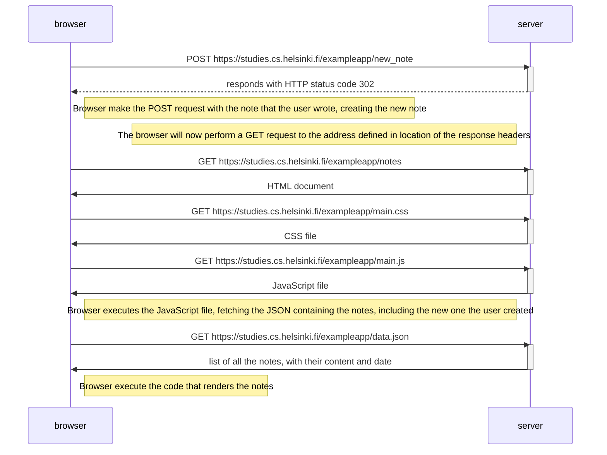

```mermaid
sequenceDiagram
  participant browser
  participant server

browser->>server: POST https://studies.cs.helsinki.fi/exampleapp/new_note
activate server
server-->>browser: responds with HTTP status code 302
deactivate server

Note right of browser: Browser make the POST request with the note that the user wrote, creating the new note
Note left of server: The browser will now perform a GET request to the address defined in location of the response headers

browser->>server: GET https://studies.cs.helsinki.fi/exampleapp/notes
activate server
server->>browser: HTML document
deactivate server

browser->>server: GET https://studies.cs.helsinki.fi/exampleapp/main.css
activate server
server->>browser: CSS file
deactivate server

browser->>server: GET https://studies.cs.helsinki.fi/exampleapp/main.js
activate server
server->>browser: JavaScript file
deactivate server

Note right of browser: Browser executes the JavaScript file, fetching the JSON containing the notes, including the new one the user created

browser->>server: GET https://studies.cs.helsinki.fi/exampleapp/data.json
activate server
server->>browser: list of all the notes, with their content and date
deactivate server

Note right of browser: Browser execute the code that renders the notes

```
