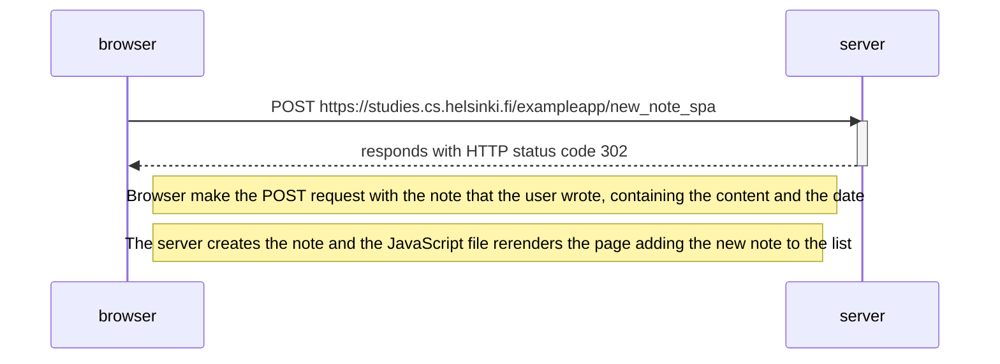

```mermaid
sequenceDiagram
  participant browser
  participant server

browser->>server: POST https://studies.cs.helsinki.fi/exampleapp/new_note_spa
activate server
server-->>browser: responds with HTTP status code 302
deactivate server

Note right of browser: Browser make the POST request with the note that the user wrote, containing the content and the date
Note right of browser: The server creates the note and the JavaScript file rerenders the page adding the new note to the list

```
